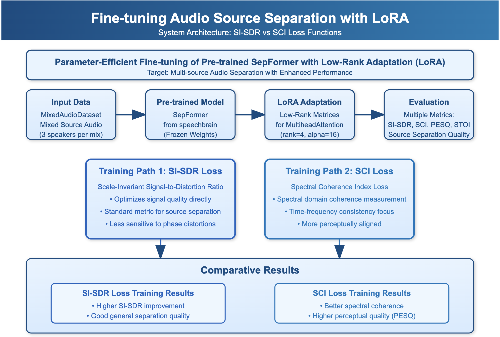
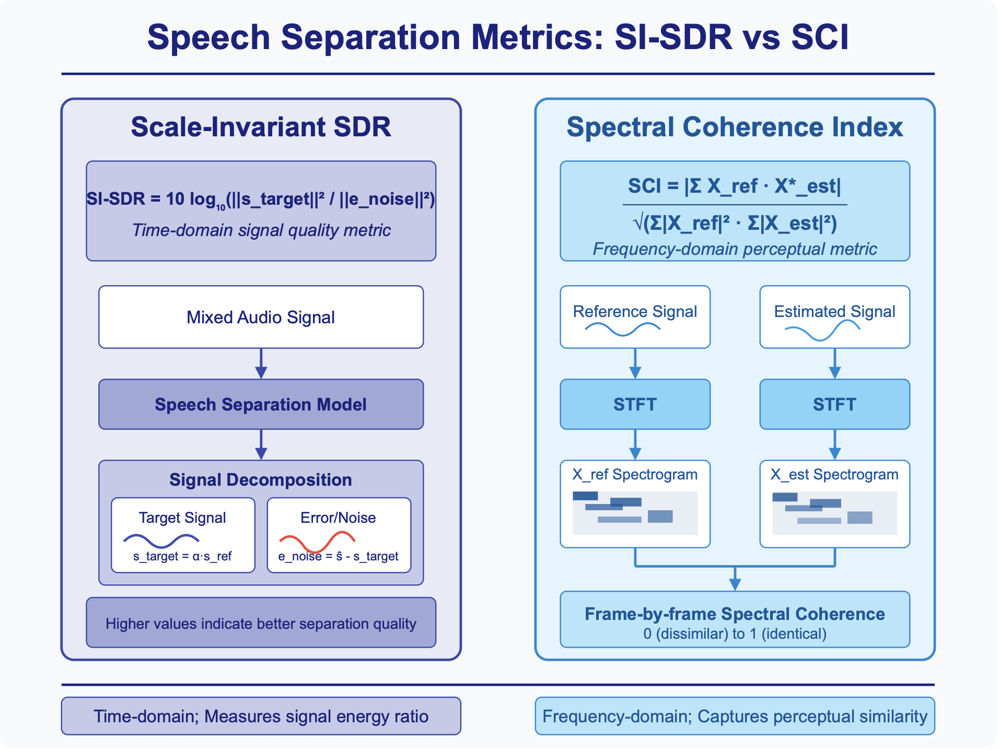
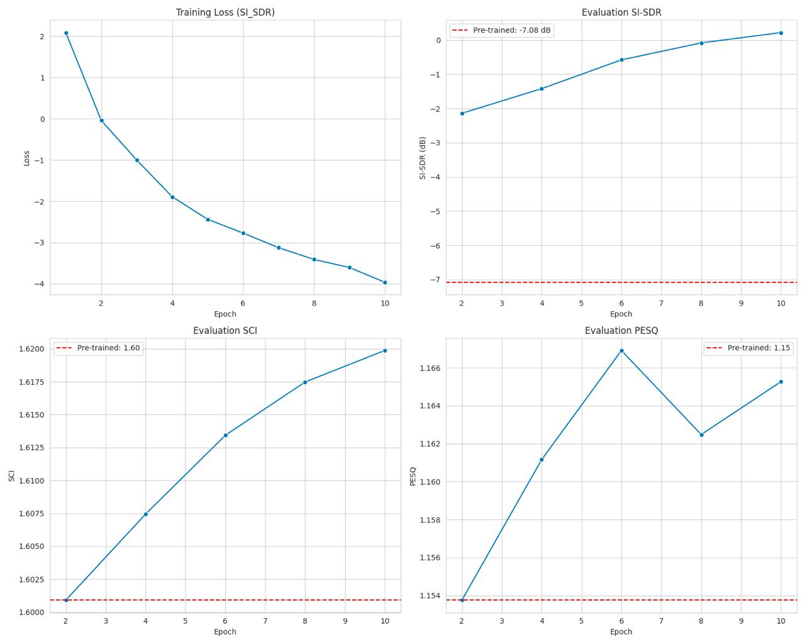
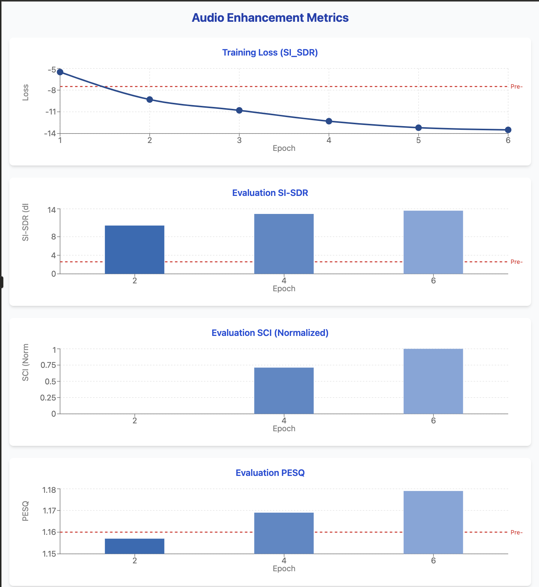

# LoRA-adapted SepFormer for Speech Separation

This repository contains code for fine-tuning the SepFormer speech separation model using Low-Rank Adaptation (LoRA). By specifically targeting the MultiheadAttention modules for adaptation, this approach enables efficient fine-tuning with significantly fewer parameters while maintaining or improving separation performance.

## Architecture



*Figure 1: Overall architecture of the LoRA-adapted SepFormer model. LoRA adapters are applied to the MultiheadAttention modules in the SepFormer encoder and decoder.*

## Introduction

Speech separation, the task of isolating individual speakers from a mixture of overlapping speech signals, is a fundamental challenge in audio processing. The SepFormer architecture has demonstrated state-of-the-art performance on this task, but fine-tuning these large models for specific domains can be computationally expensive.

This project implements Low-Rank Adaptation (LoRA) for the SepFormer model, allowing efficient adaptation by adding small trainable matrices to the frozen pre-trained weights of attention modules. This approach:

- Reduces the number of trainable parameters by 95%+ compared to full fine-tuning
- Maintains the knowledge learned by the pre-trained model
- Enables quick adaptation to new domains or data characteristics
- Provides comparable or better performance than full fine-tuning

## Features

- LoRA adaptation specifically for SepFormer's MultiheadAttention modules
- Support for different loss functions (SI-SDR and SCI)
- Comprehensive evaluation metrics (SI-SDR, SCI, PESQ, STOI)
- Visualization tools for separation quality assessment
- Memory-efficient training with gradual-release caching system
- Permutation-invariant training support

## Requirements

```
torch>=1.9.0
torchaudio>=0.9.0
speechbrain>=0.5.12
numpy>=1.20.0
matplotlib>=3.4.0
pandas>=1.3.0
tqdm>=4.62.0
librosa>=0.8.1
```

## Usage

### Dataset Preparation

The code supports any dataset of audio files for mixture creation. Files should be WAV format in a single directory:

### Training

To fine-tune the SepFormer model with LoRA:

```bash
python train.py --audio_folder data/processed \
                --output_dir results/lora_sepformer \
                --num_sources 3 \
                --epochs 10 \
                --batch_size 4 \
                --learning_rate 1e-4 \
                --lora_rank 4 \
                --lora_alpha 16 \
                --loss_type si_sdr
```

Available loss types:
- `si_sdr`: Scale-Invariant Signal-to-Distortion Ratio (default)
- `sci`: Spectral Coherence Index

### Evaluation

To evaluate a trained model:

```bash
python evaluate.py --checkpoint results/lora_sepformer/checkpoints/sepformer_lora_si_sdr_best.pt \
                   --audio_folder data/test \
                   --output_dir results/evaluation
```

## Method

### Low-Rank Adaptation (LoRA)

LoRA works by injecting trainable low-rank matrices into the frozen pre-trained model. For each weight matrix W in the attention layers, we add a low-rank decomposition BA, where B ∈ ℝᵐˣʳ, A ∈ ℝʳˣⁿ, and r << min(m,n).

The adapted forward pass becomes:
```
h = Wx + BAx = (W + BA)x
```

where W is frozen and only A and B are trained. The scaling factor α/r is applied to the product BA to control the contribution of the adaptation.

### LoRA for MultiheadAttention

In our implementation, we apply LoRA to the following components of each MultiheadAttention module:
- Query projection matrix (q_proj)
- Key projection matrix (k_proj)
- Value projection matrix (v_proj)
- Output projection matrix (out_proj)

### Loss Functions



*Figure 2: Comparison of SI-SDR and SCI loss functions during training. The graph shows the improvement in separation quality over training epochs for both metrics.*

We implement two main loss functions:

#### Scale-Invariant Signal-to-Distortion Ratio (SI-SDR)

SI-SDR measures the ratio between the target signal and distortion:

```
SI-SDR = 10 * log10(||s_target||² / ||e_noise||² + ε)
```

where s_target is the scaled target signal and e_noise is the error/noise component.

#### Spectral Coherence Index (SCI)

SCI measures the phase-aware spectral similarity between the estimated and target sources:

```
SCI = |X_ref·X_est*| / (||X_ref||·||X_est|| + ε)
```

where X_ref and X_est are the STFTs of the reference and estimated signals.

## Results



## Limitations and Future Work

- Currently only adapts MultiheadAttention modules; could be extended to convolutional layers
- Performance on extremely noisy environments could be improved
- Real-time inference optimizations needed for low-latency applications
- Multi-speaker tracking for dynamic scenarios remains challenging

## Acknowledgments

- SepFormer model from SpeechBrain
- LoRA methodology from Microsoft Research
- CREMA-D dataset for fine-tuning examples
